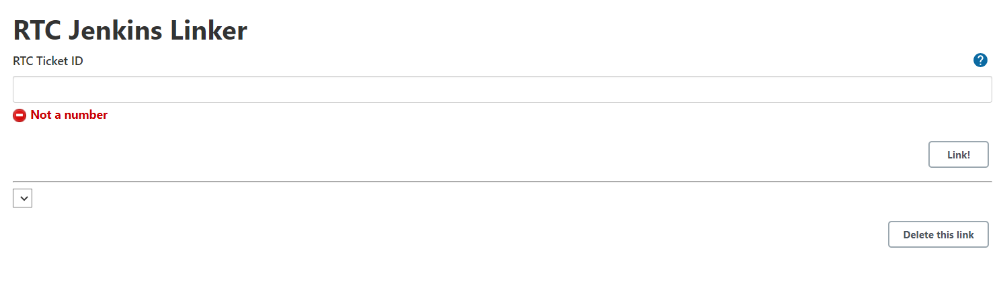
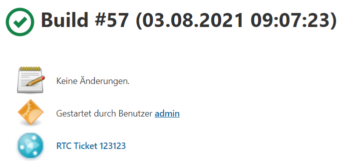
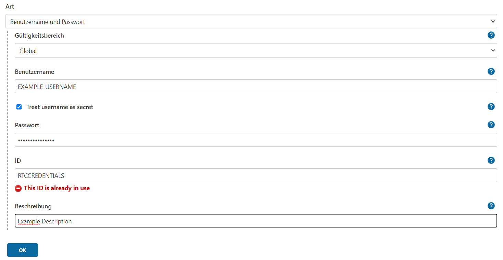

# RtcJenkinsLinker

## Introduction

This plugin bridges the gap between Jenkins and RTC. By adding the functionality to associate RTC Ticket with Jenkins builds and vice versa.

## How to build
You can build the plugin with gradle task jpi.

```
gradle clean jpi
```

The `.hpi` will be generated into `build/libs/rjl.hpi`

## Installation
Just follow this guide.
[Plugin Installation Guide](https://www.jenkins.io/doc/book/managing/plugins/#advanced-installation)
## Getting started

1. Put your RTC Link in the global configuration. Which you find under https://[YOUR-JENKINS-LINK]/configure

2. Add your Credentials for RTC. See [How to add Credentials](#How-to-add-Credentials)

3. Go to a build and then to the RTC Jenkins Linker tab.


4. Either remove a Link, or add another one by specifying the ID of the RTC ticket.



You can see if a build is linked, either from the badge in the Build History or by the entry in the builds status page.




*PS: Both are clickable to acces the RTC Ticket eveen quicker*

## How to add Credentials

1. Go to https://[YOUR-JENKINS-LINK]/credentials/store/system/domain/_/newCredentials
2. The Type should be *Username with Password*.
3. The Scope is *Global*.
4. Fill out username and password.
5. Set the ID to *RTCCREDENTIALS*
6. And save it.



## How to add a logger
1. Go to https://[YOUR-JENKINS-LINK]/log
2. Click on *Add new log recorder*
3. Give the Log recorder a name and click on *ok*
4. Than click on the button to add a new logger.
5. Give it the id *rjl*, and click on save.

(The logger logs all information on level *FINE*, and exceptions on level *SEVERE*)

## LICENSE

The MIT License

Copyright 2021

Permission is hereby granted, free of charge, to any person obtaining a copy of this software and associated documentation files (the "Software"), to deal in the Software without restriction, including without limitation the rights to use, copy, modify, merge, publish, distribute, sublicense, and/or sell copies of the Software, and to permit persons to whom the Software is furnished to do so, subject to the following conditions:

The above copyright notice and this permission notice shall be included in all copies or substantial portions of the Software.

THE SOFTWARE IS PROVIDED "AS IS", WITHOUT WARRANTY OF ANY KIND, EXPRESS OR IMPLIED, INCLUDING BUT NOT LIMITED TO THE WARRANTIES OF MERCHANTABILITY, FITNESS FOR A PARTICULAR PURPOSE AND NONINFRINGEMENT. IN NO EVENT SHALL THE AUTHORS OR COPYRIGHT HOLDERS BE LIABLE FOR ANY CLAIM, DAMAGES OR OTHER LIABILITY, WHETHER IN AN ACTION OF CONTRACT, TORT OR OTHERWISE, ARISING FROM, OUT OF OR IN CONNECTION WITH THE SOFTWARE OR THE USE OR OTHER DEALINGS IN THE SOFTWARE.